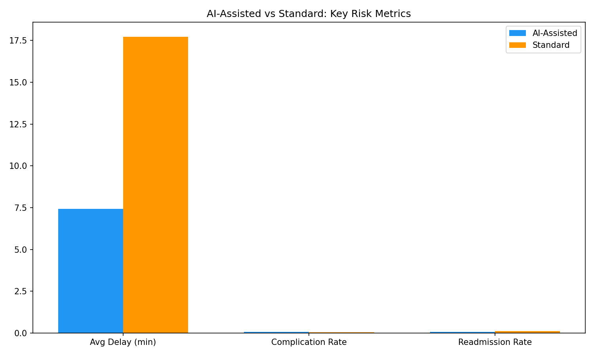
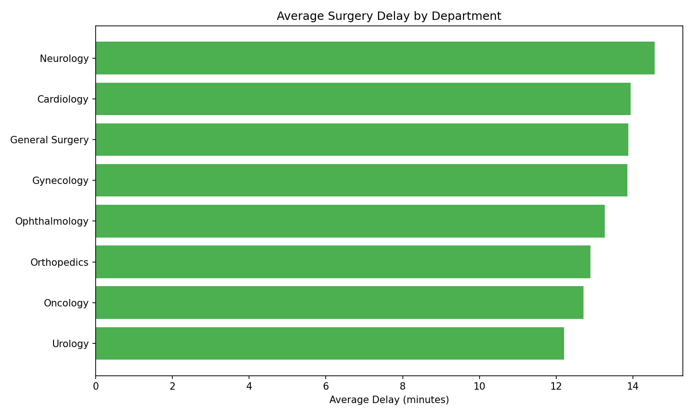
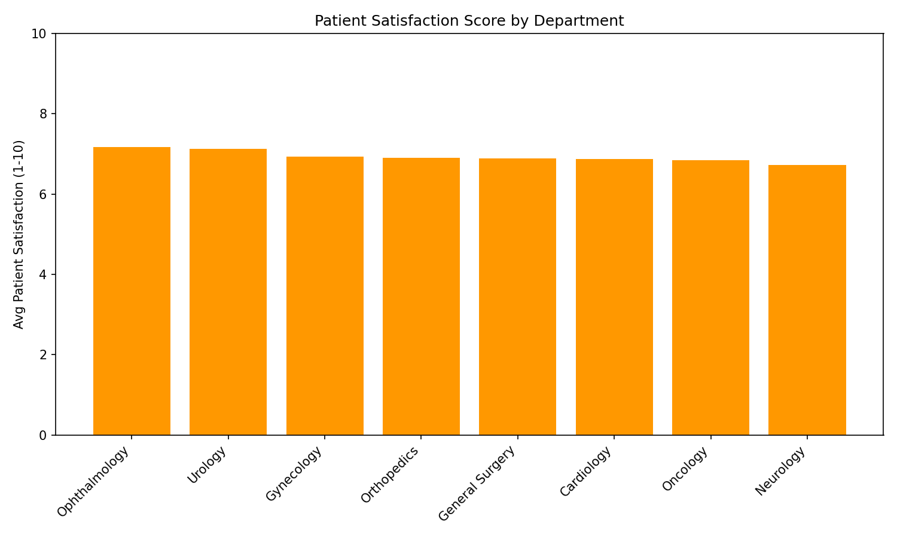
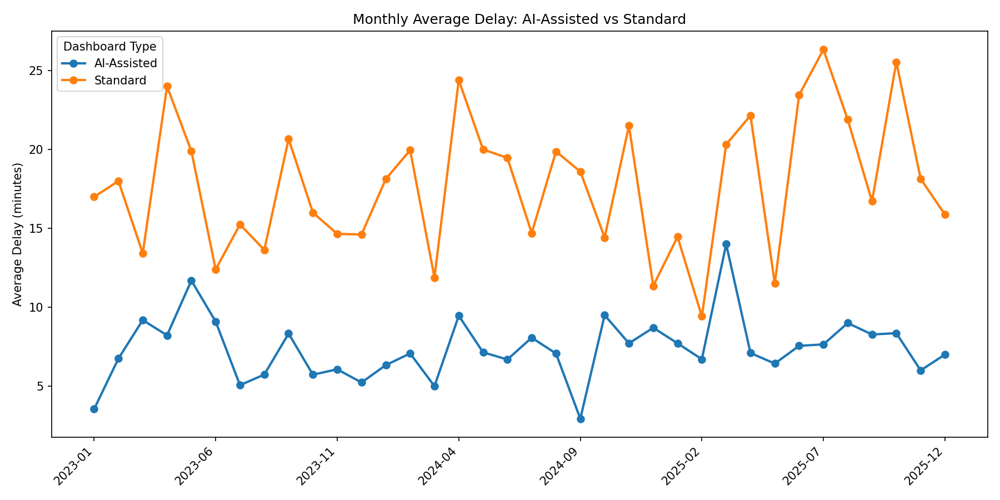
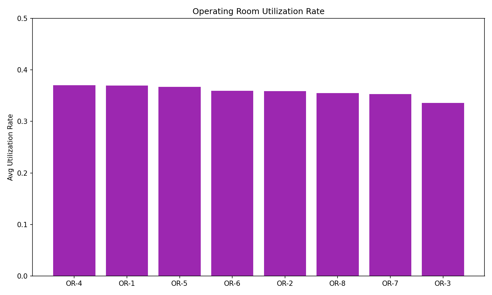

# Biotech Healthcare AI Surgical Analytics

## Industry
Healthcare / Biotech

## Research Question
Can an AI-powered surgical operations dashboard help physicians and surgeons reduce workload, identify bottlenecks, and improve operating room efficiency?

## Business Goal
Analyze surgical operations data across 8 departments and 15 surgeons to evaluate whether AI-assisted dashboards reduce delays, lower complication rates, and improve patient satisfaction.

## Public Showcase Scope
This public version includes:
- project summary and key findings
- selected screenshots and charts
- sample data (150 rows)
- output summary tables
- selected SQL queries
- dashboard plan
- AI assistance disclosure

It does **not** include the full private working files, complete Python pipeline, Excel workbook, or full raw dataset.

## Dataset
**Source:** Synthetic surgical operations data (1,200 records, 2023–2025)

## Tools Used
- Excel
- SQL
- Python
- Tableau
- AI-assisted analysis support

## 📈 Screenshots

### AI-Assisted vs Standard: Key Risk Metrics

### Average Surgery Delay by Department

### Patient Satisfaction Score by Department

### Monthly Average Delay: AI-Assisted vs Standard

### Operating Room Utilization Rate

## Key Findings
- AI-Assisted surgeries show lower average delays than Standard workflows
- Complication and readmission rates are reduced with AI dashboard support
- Patient satisfaction is higher in AI-Assisted cases
- Neurology and Cardiology have highest optimization potential

## Suggested KPIs
- Average delay (minutes)
- Complication rate (%)
- Readmission rate — 30-day (%)
- Patient satisfaction score (1-10)
- OR utilization rate
- Duration efficiency (actual vs scheduled)
- Cost per surgery

## Files in This Folder
- `sample/` — portfolio-safe sample data (150 rows)
- `outputs/` — department KPIs, AI comparison, executive summary
- `screenshots/` — 5 portfolio-ready charts
- `sql/` — selected analytical queries
- `tableau_dashboard_plan.md` — dashboard structure
- `AI_ASSISTANCE_USED.md` — AI disclosure

## AI Assistance Used
AI was used to support project structuring, data generation, README drafting, KPI brainstorming, and analytics workflow planning. Final project organization and validation were reviewed manually.
