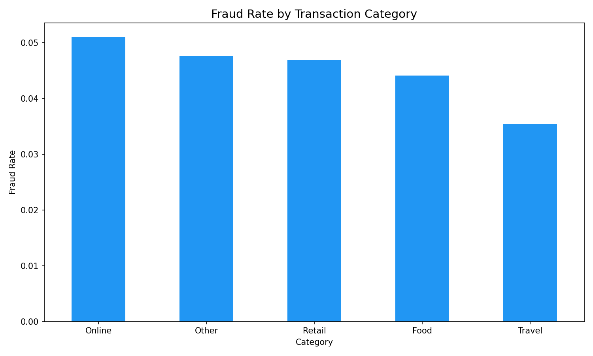
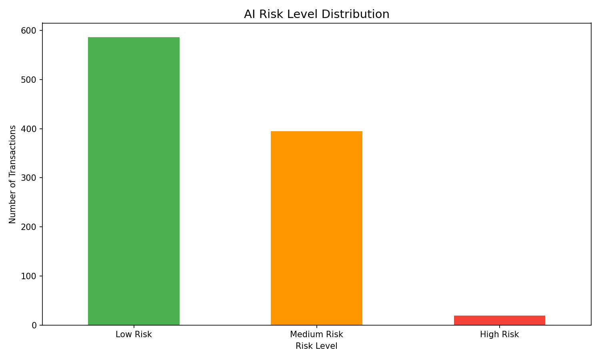
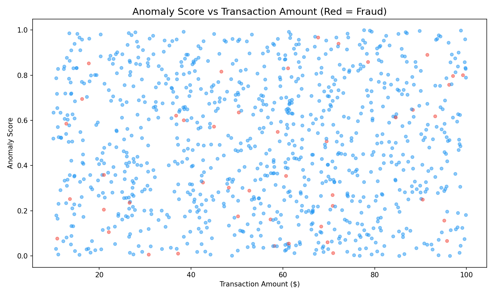
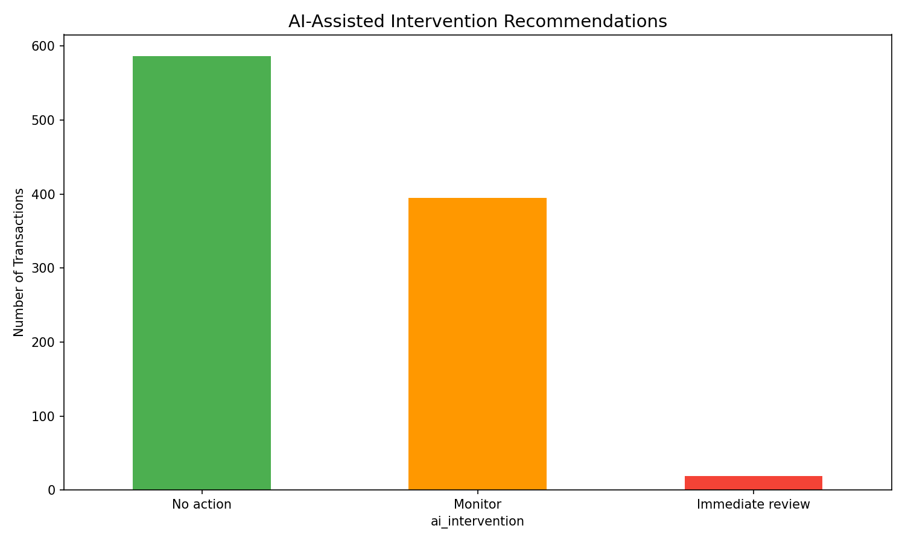

# Fintech AI Fraud & Growth Analytics — Public Showcase

## 💳 Industry
Fintech / Financial Services

## 🔍 Research Question
Can AI identify financially vulnerable customers and fraudulent transactions early enough to prevent harmful debt spirals — and enable smarter intervention before default?

## 🎯 Project Goal
Analyze financial transaction data to build AI-assisted risk scoring that identifies fraudulent patterns, evaluates anomaly indicators, and recommends intervention priorities to reduce fraud losses while minimizing false positives.

## 📊 Key Findings
- **Overall fraud rate:** 4.5% of transactions flagged as fraudulent
- **AI risk scoring:** Blended model using anomaly scores, fraud flags, suspicious indicators, and account balance
- **High Risk tier:** Concentrates the most dangerous transactions for immediate review
- **Hourly patterns:** Fraud rates vary by time of day, enabling time-based detection

## 📈 Screenshots

### Fraud Rate by Transaction Category

### AI Risk Level Distribution

### Anomaly Score vs Transaction Amount

### AI-Assisted Intervention Recommendations

## 🔧 Tools Used
- Excel — Fraud tracking and KPI analysis
- SQL — Schema and 7+ analytical queries (JOINs, CTEs, window functions)
- Python — Data merging (10 CSVs), EDA, AI risk scoring model
- Tableau — Fraud detection dashboard plan
- AI — Research framing, scoring framework, code drafting

## 📂 What's Included (Public)
- `sample/` — portfolio-safe sample dataset (150 rows)
- `outputs/` — KPI summaries, intervention analysis, executive summary
- `screenshots/` — portfolio-ready charts

## 🤖 AI Assistance Used
AI was used as an assistive tool for project structure, KPI framing, SQL/Python drafting, and documentation support. Final project organization and portfolio publishing decisions were reviewed by the analyst.

## 📌 Note
This public version is intentionally limited. The full working project, 10 raw CSV files, complete Python pipeline, and all development files are maintained in the private repository.
