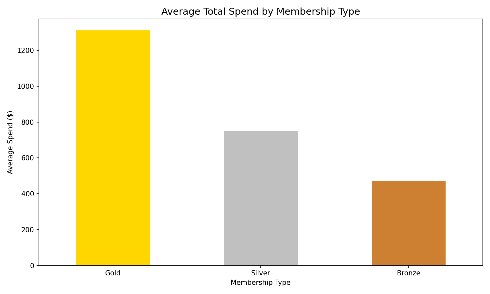
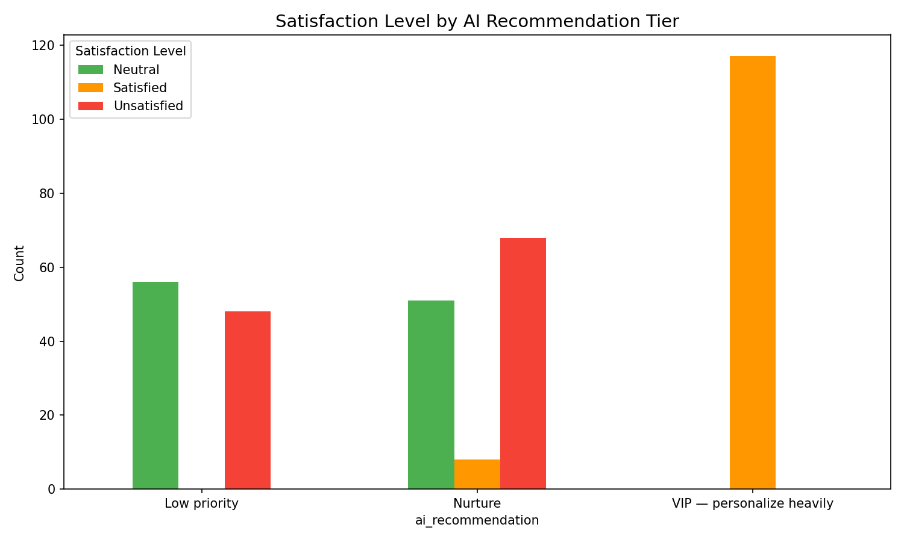
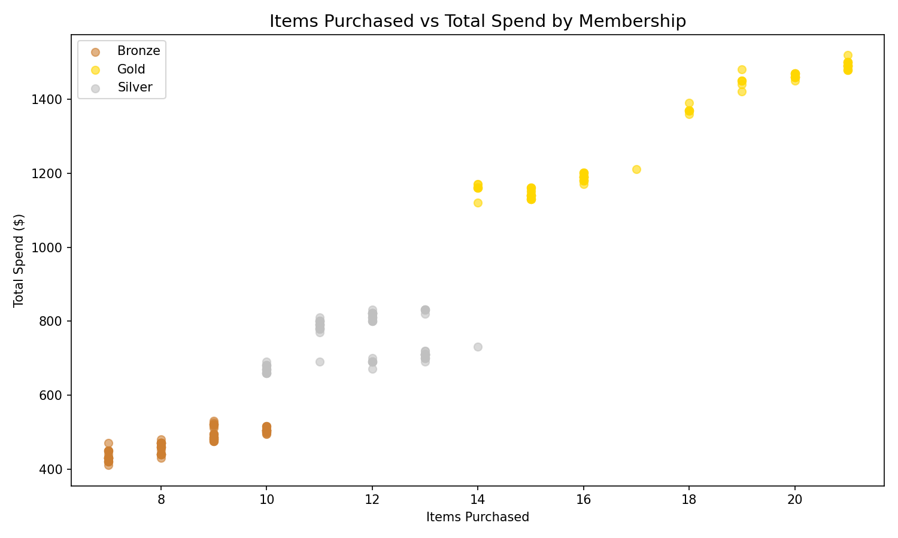
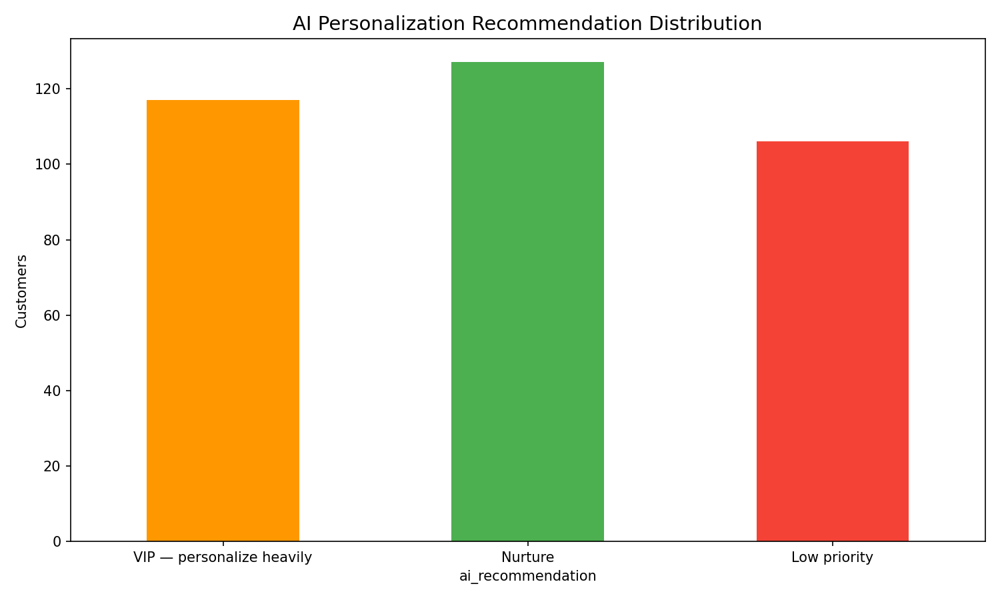

# E-Commerce AI Customer Revenue Analytics — Public Showcase

## 🛒 Industry
E-Commerce / Retail

## 🔍 Research Question
Does AI personalization increase long-term customer value — or only short-term conversions?

## 🎯 Project Goal
Analyze e-commerce customer behavior to determine whether AI-driven personalization genuinely improves customer lifetime value (LTV), repeat purchases, and retention — or primarily boosts one-time conversions.

## 📊 Key Findings
- **Gold members** deliver the highest average spend and LTV
- **VIP tier** (AI-identified) shows significantly higher LTV than Low priority customers
- **Discounts** boost satisfaction but don't guarantee long-term value
- **AI personalization scoring** effectively separates high-value from low-value customers

## 📈 Screenshots

### Average Spend by Membership

### Satisfaction by AI Recommendation Tier

### Items Purchased vs Total Spend

### AI Personalization Recommendation Distribution

## 🔧 Tools Used
- Excel — Customer segmentation and KPI tracking
- SQL — Schema and 7+ analytical queries (GROUP BY, CASE, subqueries)
- Python — Data enrichment, RFM scoring, AI personalization model
- Tableau — Customer revenue dashboard plan
- AI — Research framing, scoring framework, code drafting

## 📂 What's Included (Public)
- `sample/` — 150-row portfolio-safe dataset
- `outputs/` — membership KPIs, AI tier analysis, executive summary
- `screenshots/` — portfolio-ready charts

## 🤖 AI Assistance Used
AI was used as an assistive tool for project structure, KPI framing, SQL/Python drafting, and documentation. Final decisions were made by the analyst.

## 📌 Note
This public version is intentionally limited. Full working project and all development files are in the private repository.
