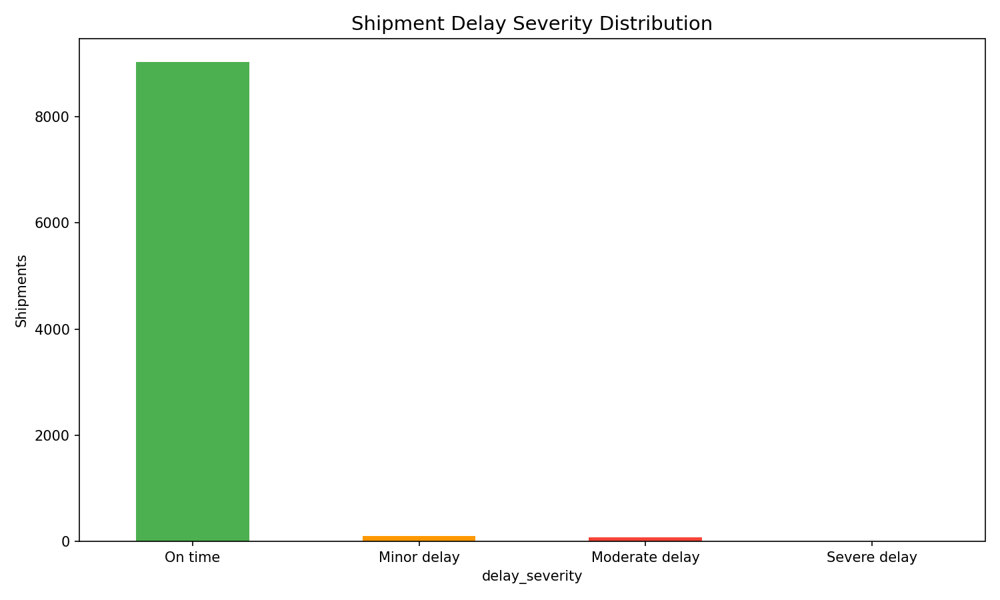
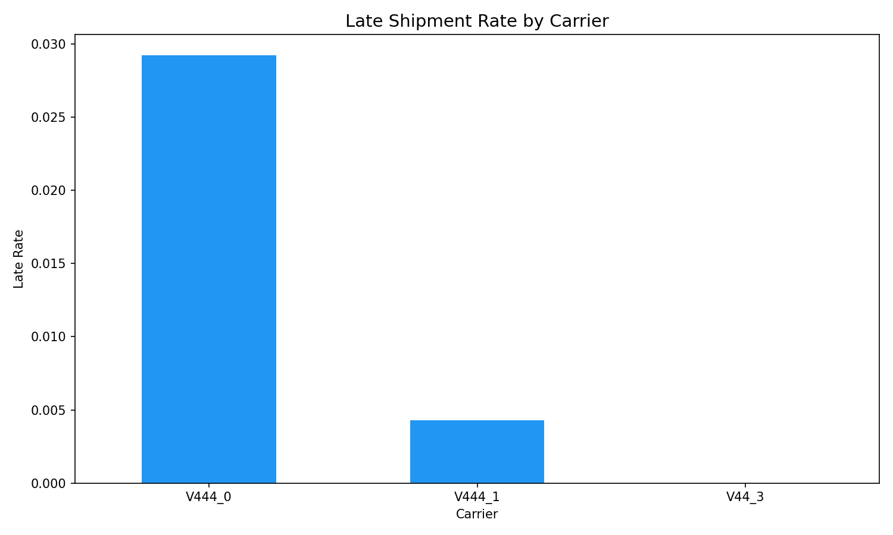
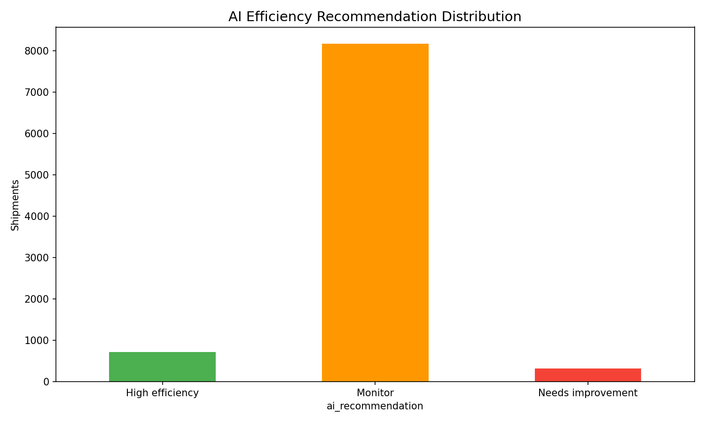
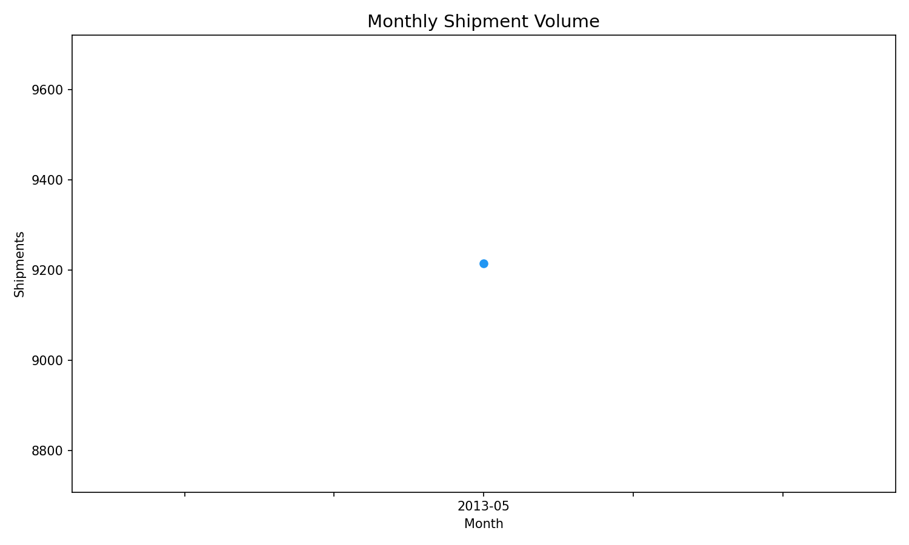

# Operations AI Efficiency Analytics — Public Showcase

## 📦 Industry
Operations / Supply Chain / Logistics

## 🔍 Research Question
How can AI-assisted analytics improve workflow efficiency, bottleneck detection, and resource allocation in business operations?

## 🎯 Project Goal
Analyze operational shipment data to identify delays, bottlenecks, and carrier performance gaps — and evaluate whether AI-assisted efficiency scoring can improve operational decision-making.

## 📊 Key Findings
- **Overall late rate:** 2.1% — strong baseline but room to optimize
- **97.9% on time** with minor, moderate, and severe delay tiers identified
- **Carrier variation:** Different carriers show distinct performance profiles
- **AI efficiency scoring** successfully identifies shipments needing attention

## 📈 Screenshots

### Shipment Delay Severity

### Late Rate by Carrier

### AI Efficiency Recommendations

### Monthly Shipment Volume

## 🔧 Tools Used
- Excel — Carrier tracking and KPI analysis
- SQL — Schema and 7+ analytical queries (GROUP BY, CTEs, HAVING)
- Python — Data enrichment, delay analysis, AI efficiency scoring
- Power BI — Operations dashboard plan
- AI — Research framing, scoring framework, code drafting

## 📂 What's Included (Public)
- `sample/` — 150-row portfolio-safe dataset
- `outputs/` — carrier KPIs, service level KPIs, AI efficiency analysis, executive summary
- `screenshots/` — portfolio-ready charts

## 🤖 AI Assistance Used
AI was used as an assistive tool for project structure, KPI framing, SQL/Python drafting, and documentation. Final decisions were made by the analyst.

## 📌 Note
This public version is intentionally limited. Full working project with 9,215 shipments and all development files are in the private repository.
